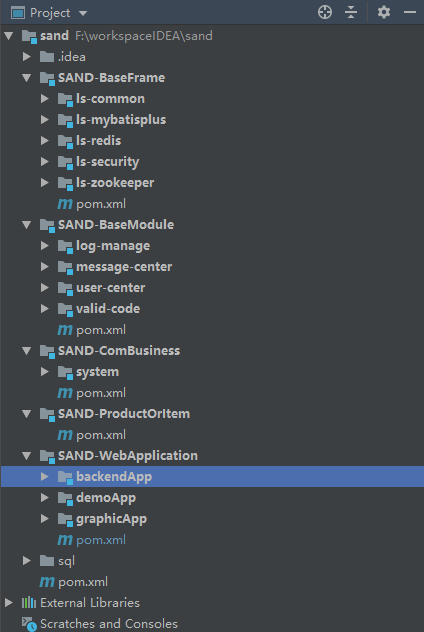
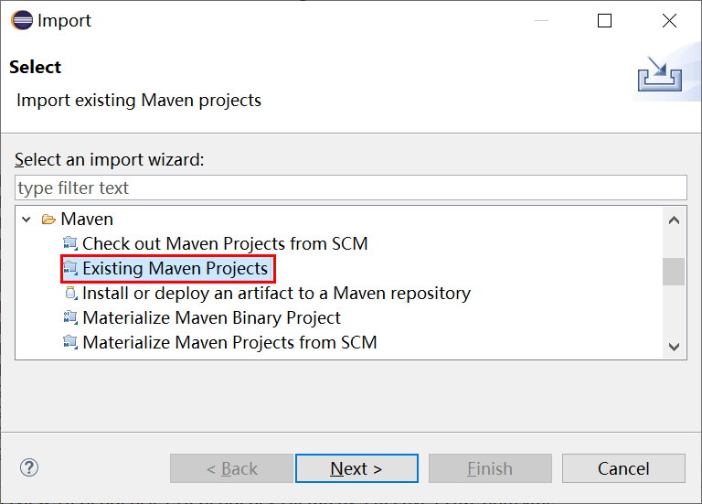
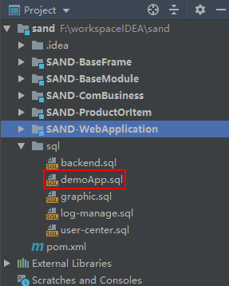
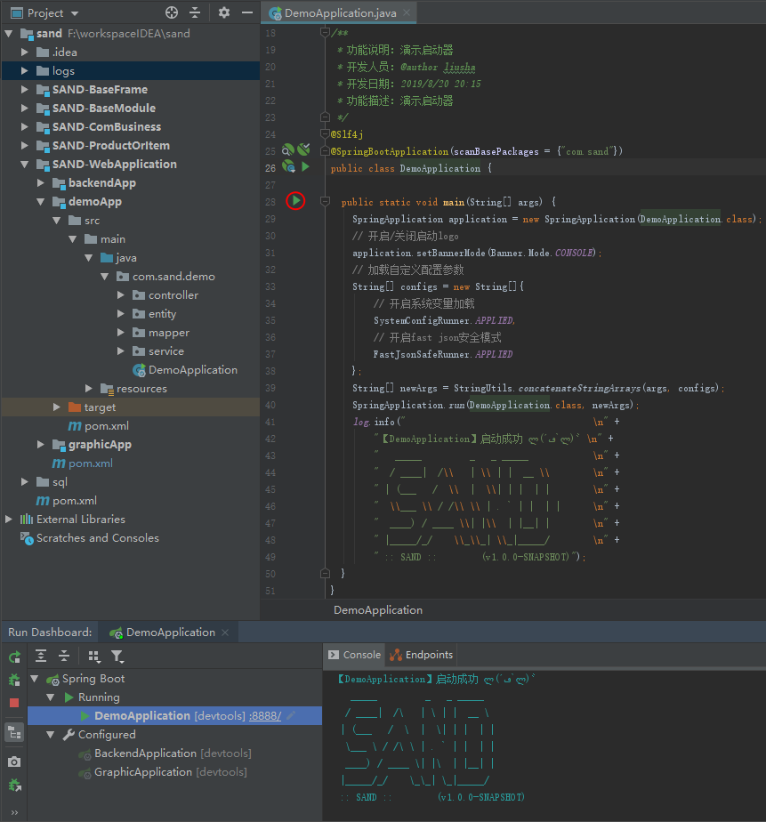

# 项目简介
项目基于JDK1.8、Mysql5.7、lombok、Spring Boot、Spring Security、Mybatis Plus构建
# 主要特性
分层开发，元件最小化
# 主要功能
基础框架、通用模块、通用业务、产品或个性化项目、启动容器
# 项目结构

 

## [SAND-BaseFrame]

基础框架：工具类库、Mybatis Plus、Redis、Spring Security、Zookeeper

### [ls-common]

通用工具类库：

### [ls-mybatisplus]

持久层Mybatis Plus：

### [ls-redis]

Session共享Redis：

### [ls-security]

安全认证Spring Security：

## [SAND-BaseModule]

通用模块：日志管理、消息中心、用户中心、验证码服务

### [log-manage]

日志管理中心：

### [message-center]

消息中心：

### [user-center]

用户中心：

### [valid-code]

验证码服务：

## [SAND-ComBusiness]

通用业务：权限体系

### [system]

权限体系：

## [SAND-WebApplication]

项目容器

# 本地环境搭建

## 一、注意事项

​	开发前需要安装lombok插件，可参考https://www.cnblogs.com/54hsh/p/11381659.html

## 二、环境准备

​	需要使用JDK1.8或以上版本，安装与配置【自行百度】

​	需安装Mysql5.7或以上版本，可参考https://www.cnblogs.com/54hsh/p/11381604.html

​	开发工具推荐使用IntelliJ IDEA，环境配置可参考https://www.cnblogs.com/54hsh/p/11273326.html

## 三、正式搭建

​	用svn或其他方式拿到源代码后，用开发工具构建好开发环境，下面分别以Eclipse和IntelliJ IDEA为例：

### Eclipse构建

​	Eclipse开发的同志建议使用Yaml Editor或其它插件编辑*.yml文件，防止错乱。

#### 1、导入项目

FIle>>Import

 

#### 2、选中Maven

选中Maven>>Existing Maven Projects

 

#### 3、找到源码路径

选中你的项目根路径，如图所示：

 

### IntelliJ IDEA构建

直接打开项目即可，IDEA会自行完成项目的转换和构建

 

`注：`不管是Eclipse还是IntelliJ IDEA，如果maven工程jar包下载缓慢的话，建议maven的settings.xml配置阿里云或华为云镜像，用如下信息替换你的settings.xml文件（**注意配置仓库地址**），待项目导入完成即完成了环境的基本搭建。

```xml
<?xml version="1.0" encoding="UTF-8"?>
<settings xmlns="http://maven.apache.org/SETTINGS/1.0.0"
          xmlns:xsi="http://www.w3.org/2001/XMLSchema-instance"
          xsi:schemaLocation="http://maven.apache.org/SETTINGS/1.0.0 http://maven.apache.org/xsd/settings-1.0.0.xsd">
  <localRepository>你的maven仓库地址</localRepository>
  <pluginGroups>

  </pluginGroups>

  <proxies>
    
  </proxies>

  <servers>
	<!-- 华为云仓库 -->
	<server>
		<id>huaweicloud</id>
		<username>anonymous</username>
		<password>devcloud</password>
	</server>
  </servers>

  <mirrors>
	<!-- 阿里云仓库 -->
    <mirror>
        <id>alimaven</id>
        <mirrorOf>central</mirrorOf>
        <name>aliyun maven</name>
        <url>http://maven.aliyun.com/nexus/content/repositories/central/</url>
    </mirror>
	<!-- 华为云仓库 -->
	<mirror>
		<id>huaweicloud</id>
		<mirrorOf>*</mirrorOf>
		<url>https://mirrors.huaweicloud.com/repository/maven/</url>
	</mirror>
  </mirrors>

  <profiles>
	
  </profiles>
</settings>
```

### 1、更改配置

 找到你需要启动的容器，以demoApp容器为例：

### 2、执行脚本

执行对应的数据库脚本文件：

 

### 3、启动项目

找到项目入口并执行main方法：

 

### 4、验证结果

项目启动成功之后使用postman验证是否能正常访问登录接口（其它接口暂未开放权限）：

http://localhost:8888/auth/user/login?username=admin&password=olCPKgwi0rk=


# Linux下服务部署


